# 📄 CI-VID: A Coherent Interleaved Text-Video Dataset
CI-VID is a large-scale dataset designed to advance **coherent multi-clip video generation**. Unlike traditional text-to-video (T2V) datasets with isolated clip-caption pairs, CI-VID supports **text-and-video-to-video (TV2V)** generation by providing over **340,000** interleaved sequences of video clips and rich captions. It enables models to learn both **intra-clip content** and **inter-clip transitions**, fostering **story-driven generation** with strong temporal and visual coherence. We also introduce a comprehensive evaluation suite including **human**, **VLM-based**, and **similarity-based** assessments. In addition, we split CI-VID into a training set (334k samples) and a test set (8k samples), enabling users to develop and evaluate their own metrics using the test set.

🔗 [📃 Paper](https://arxiv.org/abs/2507.01938)  
🔗 [📦 Download Train Samples (334k)](https://flagchat.ks3-cn-beijing.ksyuncs.com/runway_log/CI-VID_train_samples.jsonl)  
🔗 [📦 Download Test Samples (8k)](https://flagchat.ks3-cn-beijing.ksyuncs.com/runway_log/CI-VID_test_samples.jsonl)  
📦 Download Videos: CI-VID/download_all_chunks.sh

## ğŸ—‚ï¸ CI-VID Example Viewing
* 📠**Provided Files**
  * <small>`example_viewing/`</small>
    
This part of the repository contains samples extracted from CI-VID to better illustrate the dataset’s structure and characteristics.

<table>
  <tr>
    <td>
      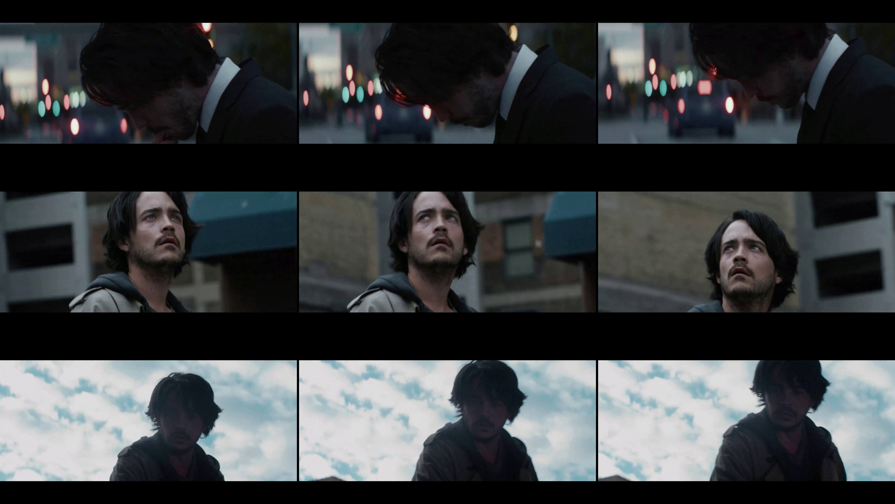
    </td>
    <td style="vertical-align: top; padding-left: 15px;">
      <small>
        🔗 <a href="https://flagchat.ks3-cn-beijing.ksyuncs.com/ymju/CI_VID_captions/672.jsonl">Download Captions</a>
      </small>
    </td>
  </tr>
  <tr>
    <td>
      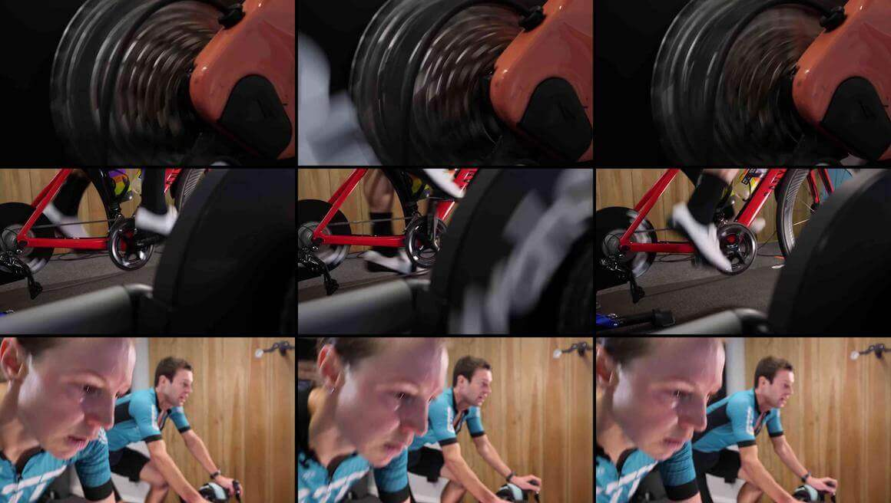
    </td>
    <td style="vertical-align: top; padding-left: 15px;">
      <small>
        🔗 <a href="https://flagchat.ks3-cn-beijing.ksyuncs.com/ymju/CI_VID_captions/067_caption.txt">Download Captions</a>
      </small>
    </td>
  </tr>
  <tr>
    <td>
      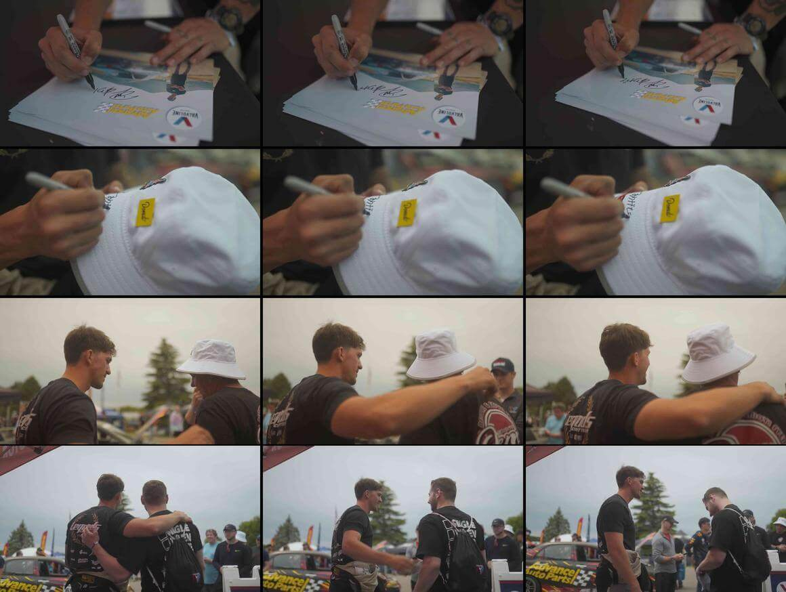
    </td>
    <td style="vertical-align: top; padding-left: 15px;">
      <small>
        🔗 <a href="https://flagchat.ks3-cn-beijing.ksyuncs.com/ymju/CI_VID_captions/001_caption.txt"> Download Captions</a>
      </small>
    </td>
  </tr>
  <tr>
    <td>
      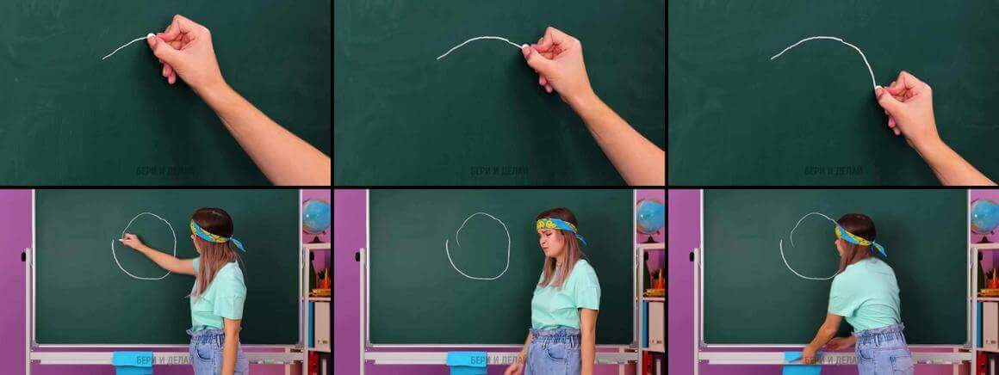
    </td>
    <td style="vertical-align: top; padding-left: 15px;">
      <small>
        🔗 <a href="https://flagchat.ks3-cn-beijing.ksyuncs.com/ymju/CI_VID_captions/020_caption.txt"> Download Captions</a>
      </small>
    </td>
  </tr>
  <tr>
    <td>
      
    </td>
    <td style="vertical-align: top; padding-left: 15px;">
      <small>
        🔗 <a href="https://flagchat.ks3-cn-beijing.ksyuncs.com/ymju/CI_VID_captions/172.jsonl"> Download Captions</a>
      </small>
    </td>
  </tr>
  <tr>
    <td>
      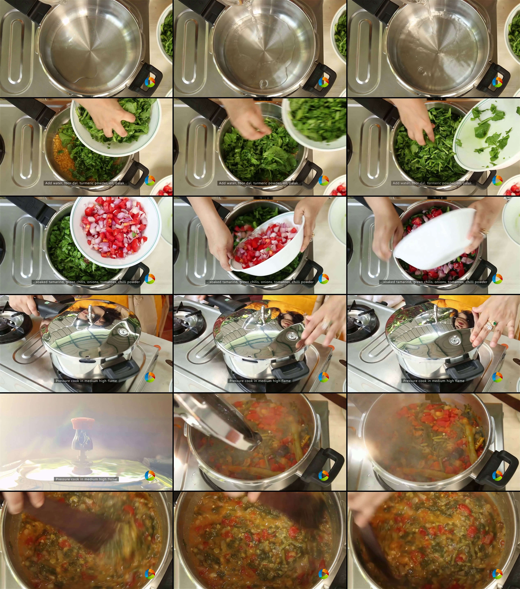
    </td>
    <td style="vertical-align: top; padding-left: 15px;">
      <small>
        🔗 <a href="https://flagchat.ks3-cn-beijing.ksyuncs.com/ymju/CI_VID_captions/055.jsonl"> Download Captions</a>
      </small>
    </td>
  </tr>
  <tr>
    <td>
      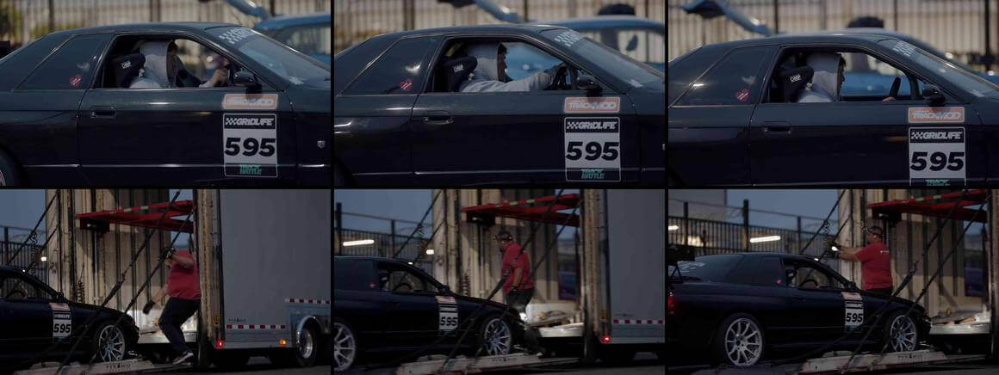
    </td>
    <td style="vertical-align: top; padding-left: 15px;">
      <small>
        🔗 <a href="https://flagchat.ks3-cn-beijing.ksyuncs.com/ymju/CI_VID_captions/003_caption.txt"> Download Captions</a>
      </small>
    </td>
  </tr>
  <tr>
    <td>
      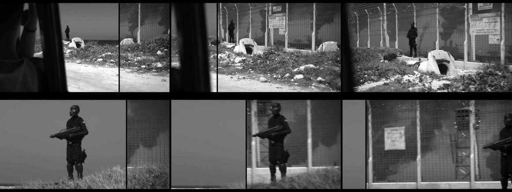
    </td>
    <td style="vertical-align: top; padding-left: 15px;">
      <small>
        🔗 <a href="https://flagchat.ks3-cn-beijing.ksyuncs.com/ymju/CI_VID_captions/076_caption.txt"> Download Captions</a>
      </small>
    </td>
  </tr>
  <tr>
    <td>
      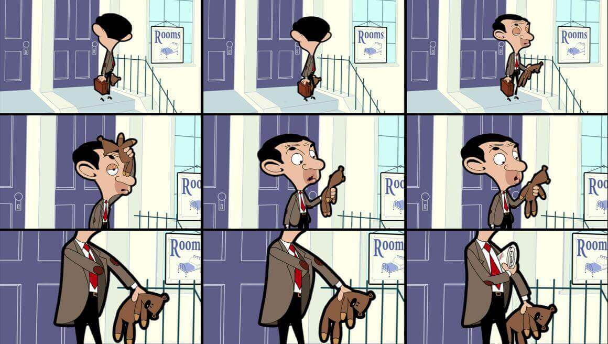
    </td>
    <td style="vertical-align: top; padding-left: 15px;">
      <small>
        🔗 <a href="https://flagchat.ks3-cn-beijing.ksyuncs.com/ymju/CI_VID_captions/109_caption.txt"> Download Captions</a>
      </small>
    </td>
  </tr>
  <tr>
    <td>
      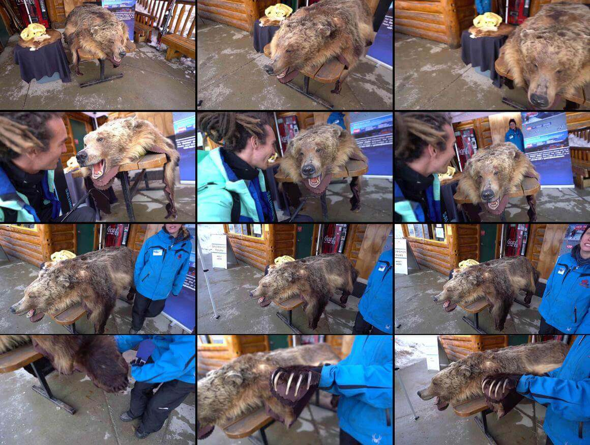
    </td>
    <td style="vertical-align: top; padding-left: 15px;">
      <small>
        🔗 <a href="https://flagchat.ks3-cn-beijing.ksyuncs.com/ymju/CI_VID_captions/096_caption.txt"> Download Captions</a>
      </small>
    </td>
  </tr>
  <tr>
    <td>
      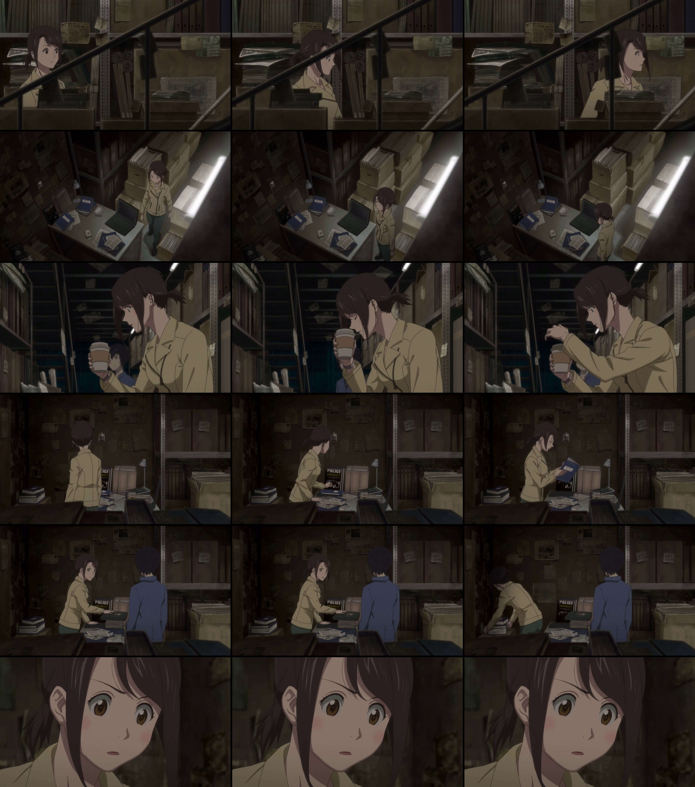
    </td>
    <td style="vertical-align: top; padding-left: 15px;">
      <small>
        🔗 <a href="https://flagchat.ks3-cn-beijing.ksyuncs.com/ymju/CI_VID_captions/044.jsonl"> Download Captions</a>
      </small>
    </td>
  </tr>
  <tr>
    <td>
      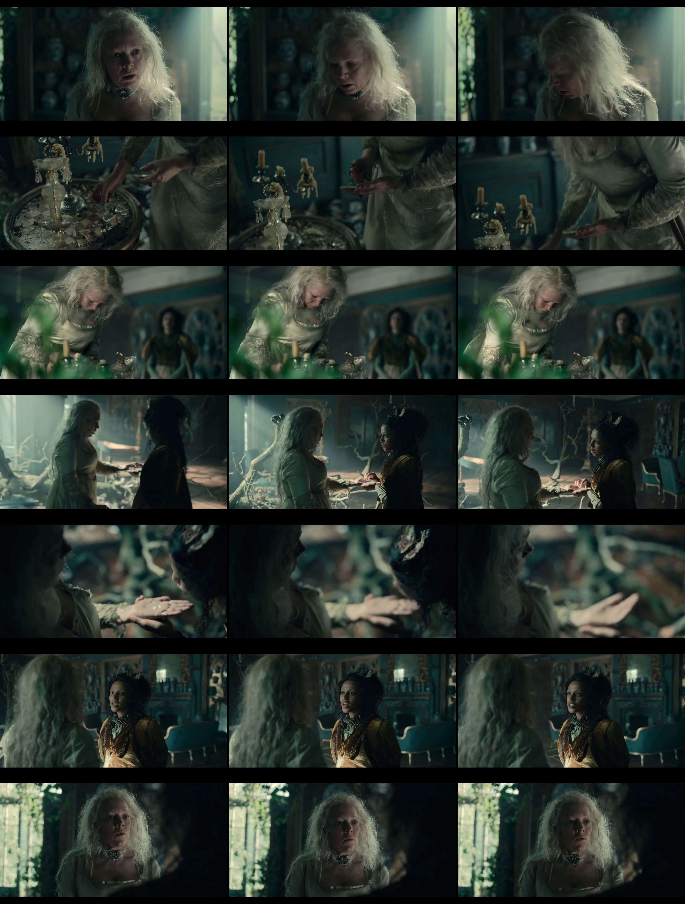
    </td>
    <td style="vertical-align: top; padding-left: 15px;">
      <small>
        🔗 <a href="https://flagchat.ks3-cn-beijing.ksyuncs.com/ymju/CI_VID_captions/025.jsonl"> Download Captions</a>
      </small>
    </td>
  </tr>
</table>

## ğŸ› ï¸ Dataset Construction Functions
* 📠**Provided Files**
  * <small>`construction_functions/`</small>

This part of the repository contains four key functions used to construct the CI-VID dataset:

1. **similarity_based_segment**  – segments raw videos based on visual similarity.
2. **entity_based_segment**  – segments videos based on main entity.
3. **individual_annotation** - generates clip-level captions individually.
4. **joint_annotation** – generates inter-clip relation captions that capture transitions and coherence.

## 📊 Quantitative Evaluation

This part of the repository contains the quantitative evaluation resources for the CI-VID dataset, including evaluation code, prompts, visualizations, and sample annotations. We provide three complementary evaluation approaches:

### 🔠Overview

We propose three evaluation protocols:

1. **Human Evaluation**  
2. **VLM-based Evaluation**  
3. **Similarity-based Evaluation**

---

### 👥 1. Human Evaluation

* 📠**Provided Files**
  * <small>`evaluation/human_evaluation/prompts.jsonl` → *Prompts used for evaluation.*</small>  
  * <small>`evaluation/human_evaluation/visual_contrast/` → *Visualizations for human evaluation (1,000 prompts). [💡download](https://flagchat.ks3-cn-beijing.ksyuncs.com/TVinterleve/visual_contrast.zip) </small>  

---

Human evaluation is based on 1,000 automatically generated prompts (Seeded with keywords from VBench), with each describing 6 scenes composing a coherent multi-scene narratives.

- **Models Compared**: Baseline (trained on Emu3) vs Fine-tuned (further finetuned on CI-VID).

- **Examples**:

<table>
  <tr>
    <td>

    </td>
    <td style="vertical-align: top; padding-left: 15px;">
      <small>
        🔗 <a href="https://flagchat.ks3-cn-beijing.ksyuncs.com/ymju/CI_VID_captions/130_test.jsonl">Download Text Prompt</a>
      </small>
    </td>
  </tr>
  <tr>
    <td>

    </td>
    <td style="vertical-align: top; padding-left: 15px;">
      <small>
        🔗 <a href="https://flagchat.ks3-cn-beijing.ksyuncs.com/ymju/CI_VID_captions/358_test.jsonl">Download Text Prompt</a>
      </small>
    </td>
  </tr>
  <tr>
    <td>

    </td>
    <td style="vertical-align: top; padding-left: 15px;">
      <small>
        🔗 <a href="https://flagchat.ks3-cn-beijing.ksyuncs.com/ymju/CI_VID_captions/093_test.jsonl"> Download Text Prompt</a>
      </small>
    </td>
  </tr>
  <tr>
    <td>

    </td>
    <td style="vertical-align: top; padding-left: 15px;">
      <small>
        🔗 <a href="https://flagchat.ks3-cn-beijing.ksyuncs.com/ymju/CI_VID_captions/137_test.jsonl"> Download Text Prompt</a>
      </small>
    </td>
  </tr>
  <tr>
    <td>

    </td>
    <td style="vertical-align: top; padding-left: 15px;">
      <small>
        🔗 <a href="https://flagchat.ks3-cn-beijing.ksyuncs.com/ymju/CI_VID_captions/181_test.jsonl"> Download Text Prompt</a>
      </small>
    </td>
  </tr>
  <tr>
    <td>

    </td>
    <td style="vertical-align: top; padding-left: 15px;">
      <small>
        🔗 <a href="https://flagchat.ks3-cn-beijing.ksyuncs.com/ymju/CI_VID_captions/012_test.jsonl"> Download Text Prompt</a>
      </small>
    </td>
  </tr>
</table>

- **Procedure**: 3 professional annotators compare model outputs across:
<small>
  -  *Consistency*
  -  *Narrativity*
  -  *Factual correctness*
</small>

- **Judgment Format**: Side-by-side comparison, anonymized model identity, random top-bottom order.

---

### 🤖 2. VLM-based Evaluation
* 📠**Provided Files**
  * <small>`evaluation/vlm_evaluation/vlm_evaluation_data.jsonl` → *Prompts used for evaluation.*</small>  
  * <small>`evaluation/vlm_evaluation/vlm_evaluation.py` → Code for VLM-based evaluation </small>  
---

We use the same prompts as human evaluation perform a VLM-based evaluation.

- **Procedure**:  Qwen2-VL-72B-Instruct is prompted to assess model outputs along the following six dimensions:
<small>

- 1. **Stylistic Consistency**  
  the visual styles of frames need to be consistent (e.g., color tone, lighting, rendering technique, texture details)

- 2. **Entity Consistency**  
  the key characters and objects need to be consistent across frames. (e.g., retain the same attributes and identity)

- 3. **Background Consistency**  
  the backgrounds and environments need to be consistent across frames? 

- 4. **Perspective Transition Coherence**  
  the transitions between camera angles and scenes need to be smooth and logically aligned.

- 5. **Text Prompt Alignment**  
  the frames need to be accurately reflect the content and intent of the original text prompts.prompt.

- 6. **Visual Plausibility**  
  is the overall visual quality realistic? Are there any noticeable artifacts, glitches, or implausible elements?

</small>

- **Score Guide**:

<small>

  - **5 - Very Excellent:**  
    Perfect: not only flawless but demonstrate outstanding consistency and execution.
    
  - **4 – Excellent:**  
    Flawless: no noticeable issues.

  - **3 – Good:**  
    Nearly flawless, with only minor, negligible imperfections. 

  - **2 – Fair:**  
    Minor flaws observed in one clip.

  - **1 – Poor:**  
    Major or multiple flaws.

  - **0 – Very Poor:**  
    Multiple (> 1) major flaws.
</small>

> 🧪 Averaged over 6 evaluations per sample (1 full + 5 pairwise), with VLM calibration via reference examples.

### 🯠3. Similarity-based Evaluation

* 📠**Provided Files**
  * <small>`evaluation/similarity_evaluation/object_similarity_data.jsonl` → *Captions and first clips for similarity-based evaluation.*</small>  
  * <small>`evaluation/similarity_evaluation/object_similarity_evaluation.py` → Code for computing similarity evaluation.</small>
  * <small>`object_similarity_data.jsonl` → Data for model inference. [💡download](https://flagchat.ks3-cn-beijing.ksyuncs.com/TVinterleve/object_similarity_data.jsonl) </small>  
  * <small>`middle_frames.zip` → *Ground-truth middle frames for similarity evaluation. [💡download](https://flagchat.ks3-cn-beijing.ksyuncs.com/TVinterleve/middle_frames_for_sim_eval.zip) </small>  
  * <small>`rectangles.zip` → *Ground-truth entity boxes for similarity evaluation. [💡download](https://flagchat.ks3-cn-beijing.ksyuncs.com/TVinterleve/rectangles.zip)  </small>  
  * <small>`CI-VID_results.zip` → *Visualizations of results from the CI-VID fine-tuned model. [💡download](https://flagchat.ks3-cn-beijing.ksyuncs.com/TVinterleve/CoI-VID_sim_results.zip)  </small>  
  * <small>`observation_for_object_similarity_data.zip` → *Visual observation files for similarity-based evaluation data. [💡download](https://flagchat.ks3-cn-beijing.ksyuncs.com/TVinterleve/observation_for_object_similarity_data.zip)  </small>  
  * <small>`sim_eval_img_package.zip` → Entity boxes data with imgs. [💡download](https://flagchat.ks3-cn-beijing.ksyuncs.com/TVinterleve/sim_eval_boxes_data_package.zip) </small>  

---

We construct a similarity-based evaluation dataset based on CI-VID data. To avoid data leakage, all test data and data from the same source videos are excluded from the CI-VID training set. This evaluation compares the similarity between the generated and ground-truth videos at both the **global** and **object** levels.

---

#### âš™ï¸ Evaluation Setup

1. **Object Detection**:  
   YOLO is applied to each video clip. For every clip, 3 frames are uniformly sampled and processed.

2. **Manual Filtering**:  
   Non-essential objects are removed manually. A maximum of two narrative-relevant object boxes are kept per frame.

3. **Evaluation Protocol**:  
   - Each sample includes the **first clip** and the **full caption** as input.  
   - The evaluated model generates the remaining video clips.
   - We compute similarity between:
     - Generated and ground-truth **middle frames** → for **whole-sequence similarity**
     - Object boxes in generated and reference frames → for **object-level similarity**
   - For object similarity, we match each generated object to ground-truch object across 3 frames per clip, and use the best score as the clip score, then average all clip scores as sample score. The final results are the average of all samples.

- **Ground-truth Examples**:
<table>
  <tr>
    <td>
      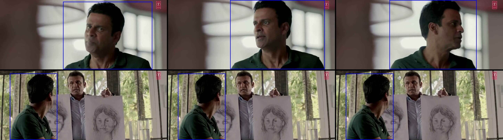
    </td>
    <td style="vertical-align: top; padding-left: 15px;">
      <small>
        🔗 <a href="https://flagchat.ks3-cn-beijing.ksyuncs.com/ymju/CI_VID_captions/812.jsonl">Download Captions</a>
      </small>
    </td>
  </tr>
  <tr>
    <td>
      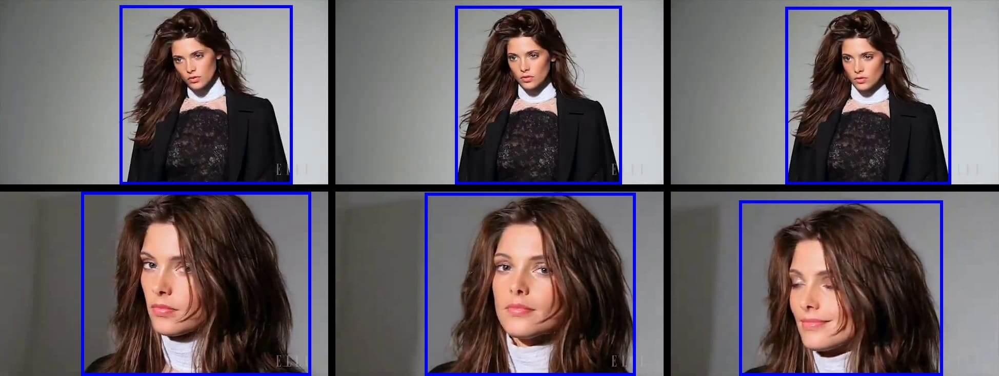
    </td>
    <td style="vertical-align: top; padding-left: 15px;">
      <small>
        🔗 <a href="https://flagchat.ks3-cn-beijing.ksyuncs.com/ymju/CI_VID_captions/1099.jsonl">Download Captions</a>
      </small>
    </td>
  </tr>
  <tr>
    <td>
      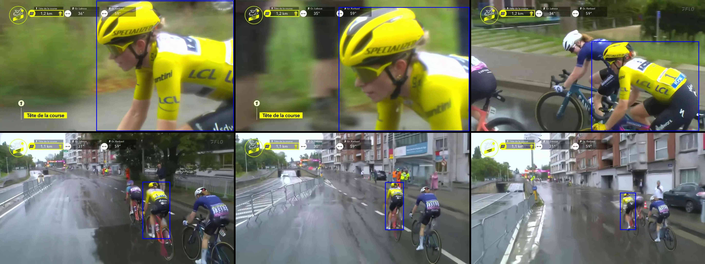
    </td>
    <td style="vertical-align: top; padding-left: 15px;">
      <small>
        🔗 <a href="https://flagchat.ks3-cn-beijing.ksyuncs.com/ymju/CI_VID_captions/969.jsonl"> Download Captions</a>
      </small>
    </td>
  </tr>
 
  <tr>
    <td>
      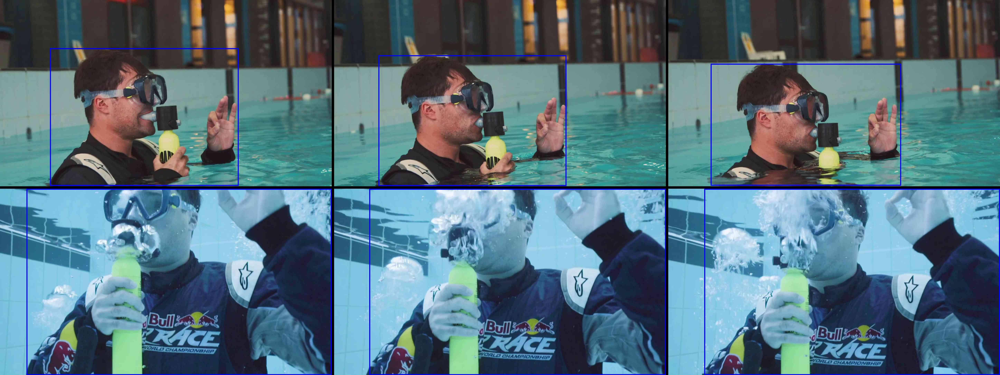
    </td>
    <td style="vertical-align: top; padding-left: 15px;">
      <small>
        🔗 <a href="https://flagchat.ks3-cn-beijing.ksyuncs.com/ymju/CI_VID_captions/970.jsonl"> Download Captions</a>
      </small>
    </td>
  </tr>
  
  <tr>
    <td>
      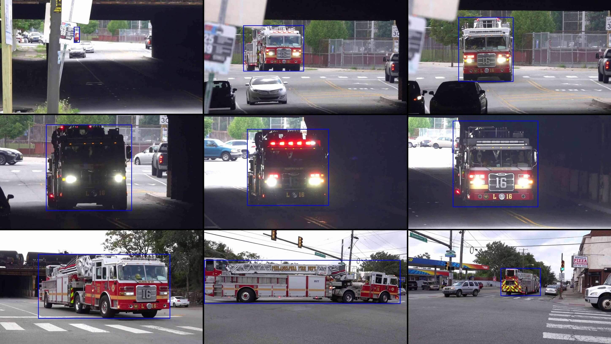
    </td>
    <td style="vertical-align: top; padding-left: 15px;">
      <small>
        🔗 <a href="https://flagchat.ks3-cn-beijing.ksyuncs.com/ymju/CI_VID_captions/656.jsonl"> Download Captions</a>
      </small>
    </td>
  </tr>
  
  <tr>
    <td>
      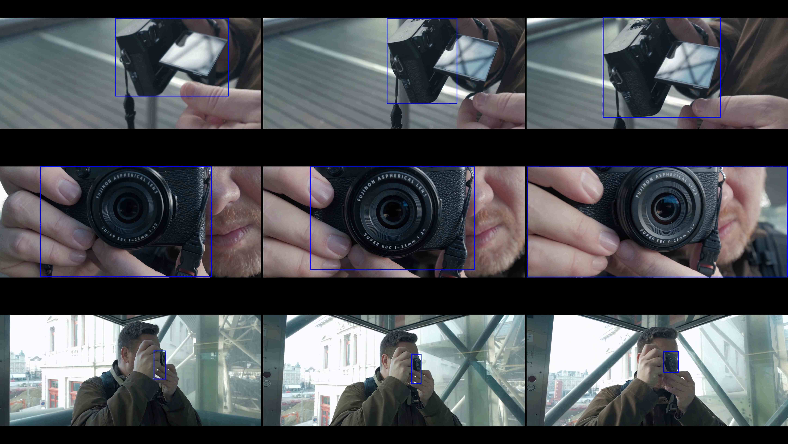
    </td>
    <td style="vertical-align: top; padding-left: 15px;">
      <small>
        🔗 <a href="https://flagchat.ks3-cn-beijing.ksyuncs.com/ymju/CI_VID_captions/701.jsonl"> Download Captions</a>
      </small>
    </td>
  </tr>
  

  <tr>
    <td>
      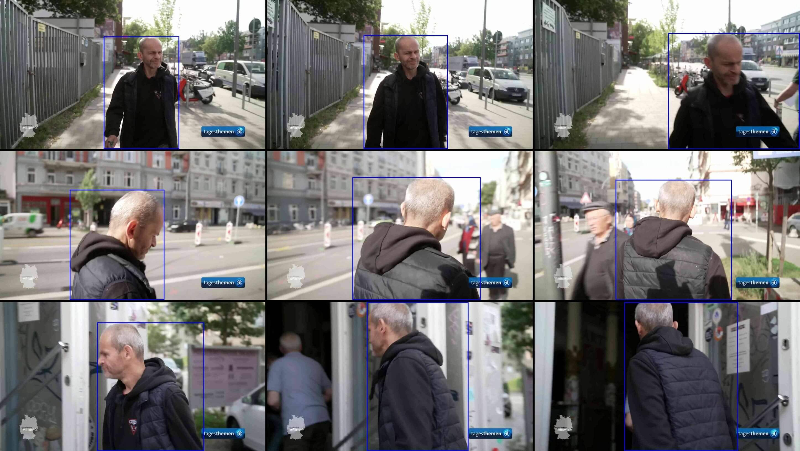
    </td>
    <td style="vertical-align: top; padding-left: 15px;">
      <small>
        🔗 <a href="https://flagchat.ks3-cn-beijing.ksyuncs.com/ymju/CI_VID_captions/465.jsonl"> Download Captions</a>
      </small>
    </td>
  </tr>
  
  <tr>
    <td>
      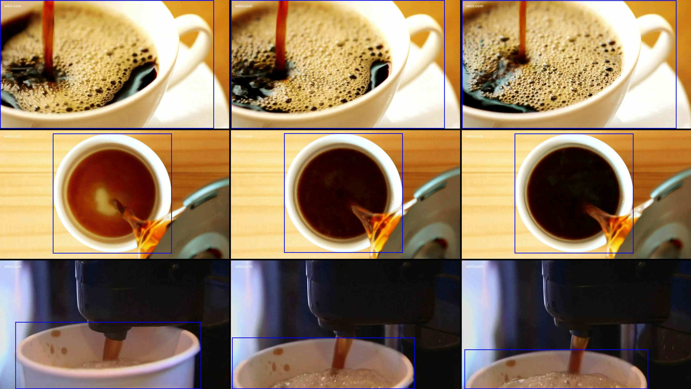
    </td>
    <td style="vertical-align: top; padding-left: 15px;">
      <small>
        🔗 <a href="https://flagchat.ks3-cn-beijing.ksyuncs.com/ymju/CI_VID_captions/666.jsonl"> Download Captions</a>
      </small>
    </td>
  </tr>

   <tr>
    <td>
      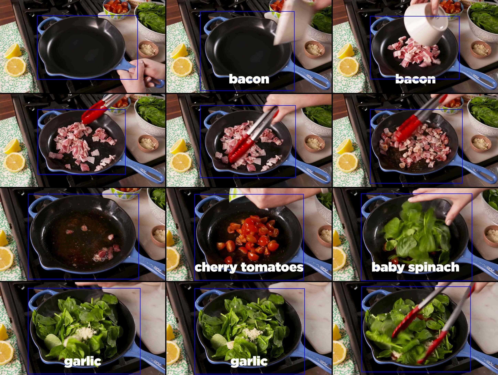
    </td>
    <td style="vertical-align: top; padding-left: 15px;">
      <small>
        🔗 <a href="https://flagchat.ks3-cn-beijing.ksyuncs.com/ymju/CI_VID_captions/394.jsonl"> Download Captions</a>
      </small>
    </td>
  </tr>
  
  <tr>
    <td>
      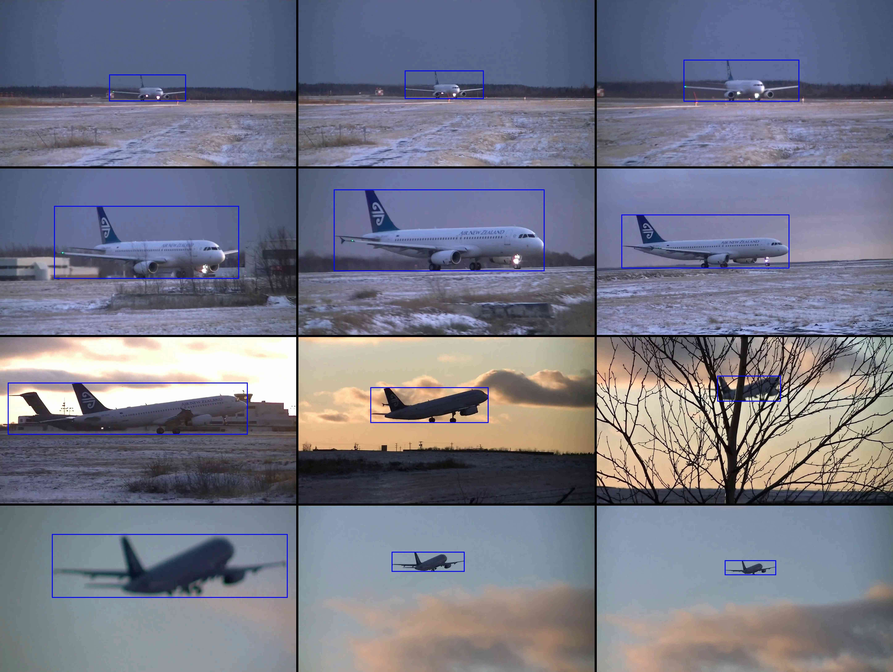
    </td>
    <td style="vertical-align: top; padding-left: 15px;">
      <small>
        🔗 <a href="https://flagchat.ks3-cn-beijing.ksyuncs.com/ymju/CI_VID_captions/373.jsonl"> Download Captions</a>
      </small>
    </td>
  </tr>

   <tr>
    <td>
      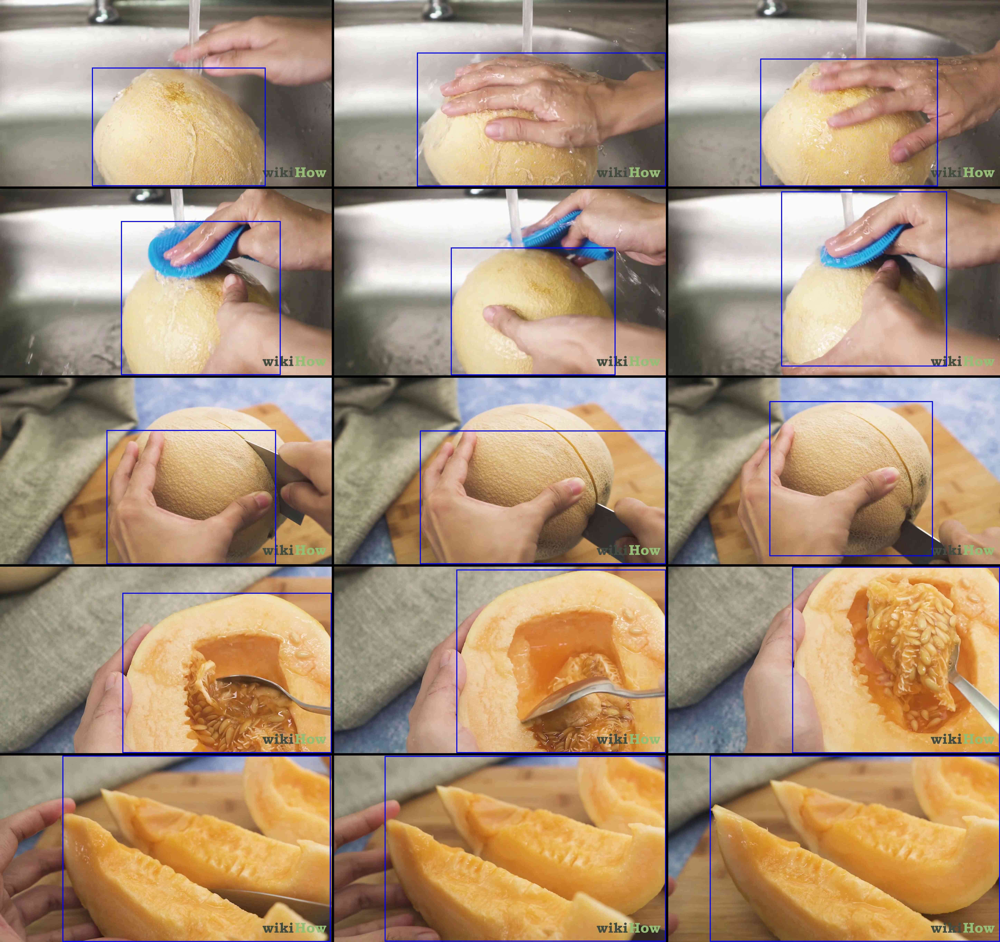
    </td>
    <td style="vertical-align: top; padding-left: 15px;">
      <small>
        🔗 <a href="https://flagchat.ks3-cn-beijing.ksyuncs.com/ymju/CI_VID_captions/116.jsonl"> Download Captions</a>
      </small>
    </td>
  </tr>
  
  <tr>
    <td>
      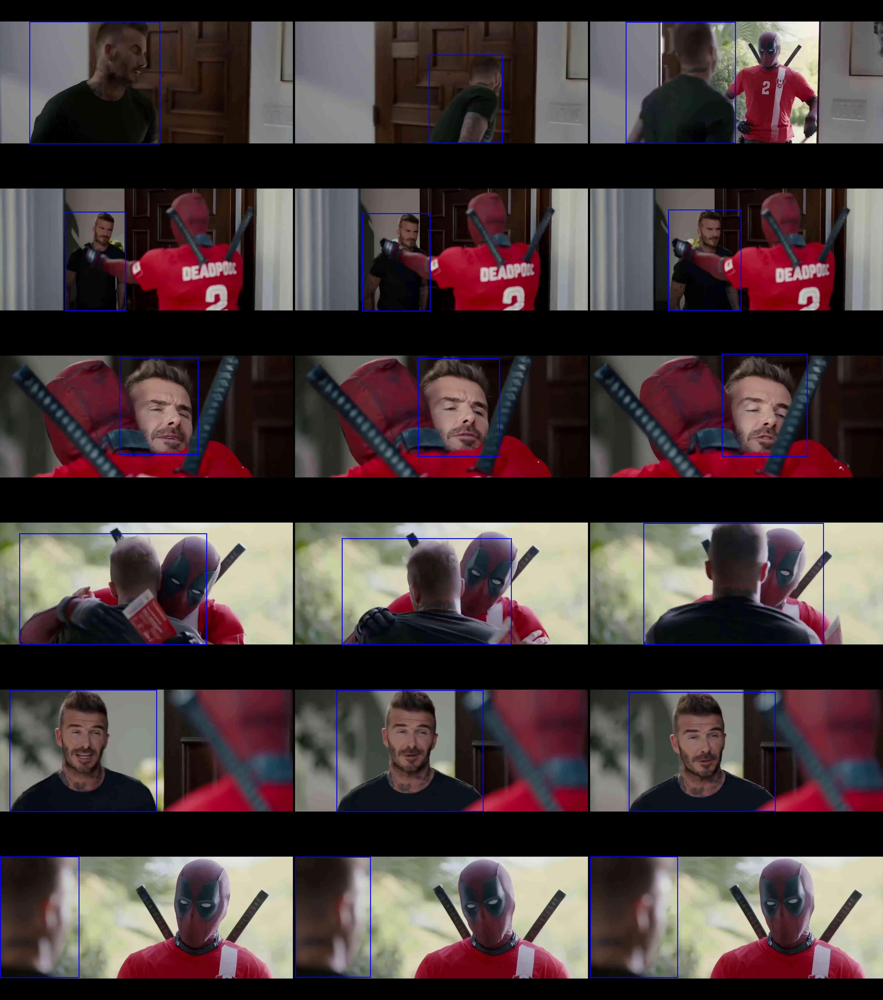
    </td>
    <td style="vertical-align: top; padding-left: 15px;">
      <small>
        🔗 <a href="https://flagchat.ks3-cn-beijing.ksyuncs.com/ymju/CI_VID_captions/075.jsonl"> Download Captions</a>
      </small>
    </td>

   <tr>
    <td>
      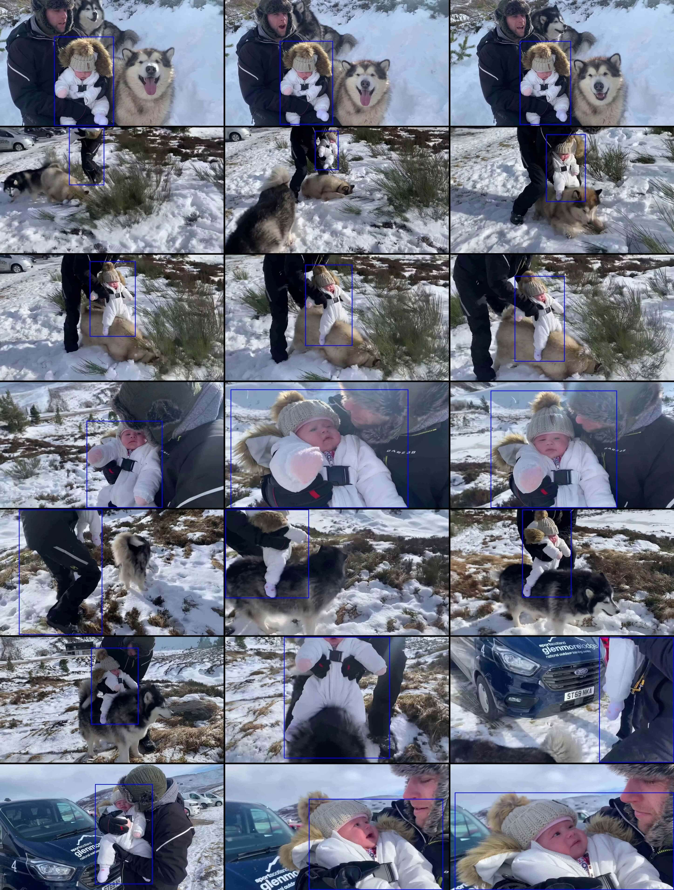
    </td>
    <td style="vertical-align: top; padding-left: 15px;">
      <small>
        🔗 <a href="https://flagchat.ks3-cn-beijing.ksyuncs.com/ymju/CI_VID_captions/002.jsonl"> Download Captions</a>
      </small>
    </td>
    
  </tr>

  
</table>

### Research-Only License

This dataset is provided **for non-commercial, research purposes only**.

- Commercial use is **not allowed**.
- Redistribution or repackaging is **not permitted** without prior consent.

  

---

